<link rel="stylesheet" type="text/css" href="../CSS/APLK.css">

# Adverbial Postpositions In Korean (APIK)

## Abstract
To conduct the research on Korean adverbial postpositions, I need a corpus with the intended functions of postpositions tagged in each sentence. However, the [Sejong corpus](https://www.korean.go.kr), mother corpus of my study does not code the functions of postpositions directly. Therefore, I annotate the corpus manually with the help of three native speakers of Korean. Among the three, one was an instructor who teaches Korean to children and the other two were Ph.D. candidates in linguistics. They managed all the details of the corpus annotation, from the development of the annotation manual to the manual annotation of the intended function of postposition in each sentence.    
Regarding the process of creating a hand-coded corpus, I extract sentences having only one postposition and predicate. Although this manipulation omitted many sentences already extracted from the original corpus, it was beneficial for controlling any additional confounding factors which could have interfered with the performance of my model. If a sentence contains more than one postposition, including the three postpositions that I focused on, they become less independent of each other. This means the model performance of each postposition will be affected by each other. This reduction process resulted in a total of 27,720 sentences, with 14,096 sentences for <i>-ey</i>, 5,078 sentences for <i>-eyse</i>, and 8,546 sentences for <i>-(u)lo</i>. I then extract 5,000 sentences randomly for each postposition to keep an equal number of sentences for each one.   
The final corpus data are then hand-coded by the three native speakers of Korean, following the functions of the individual postpositions. The inter-rater reliability of the data was measured with the Fleiss's Kappa ([Landis and Koch, 1977](https://www.jstor.org/stable/2529310?seq=1)). The results were a score of 0.948 for <i>-ey</i>, 0.928 for <i>-eyse</i>, and 0.947 for <i>-(u)lo</i>, which are considered <i>almost perfect</i> according to the Kappa scale. I decide to exclude sentences that caused disagreement among the human annotators (i.e., 285 sentences for <i>-ey</i>, 147 sentences for <i>-eyse</i>, and 292 sentences for <i>-(u)lo</i>). After which, I obtain the final corpus
data for each postposition. This yielded 4,715 sentences for <i>-ey</i>, 4,853 sentences for <i>-eyse</i>, and 4,708 sentences for <i>-(u)lo</i>. The table below presents the detailed by-function frequency list of the three postposition types.

## By-function frequency list of <i>-ey</i>, <i>-eyse</i>, and <i>-(u)lo</i> in cross-validated corpus.

| ***-ey*** |           | ***-eyse*** |           | ***-(u)lo*** |           |
|:----------|:---------:|:------------|:---------:|:-------------|:---------:|
| Function  | Frequency | Function    | Frequency | Function     | Frequency |
| LOC       |   1,780   | LOC         |   4,206   | FNS          |   1,681   |
| CRT       |   1,516   | SRC         |    647    | DIR          |   1,449   |
| THM       |    448    |             |           | INS          |    739    |
| GOL       |    441    |             |           | CRT          |    593    |
| FNS       |    216    |             |           | LOC          |    158    |
| EFF       |    198    |             |           | EFF          |    88     |
| INS       |    69     |             |           |              |           |
| AGT       |    47     |             |           |              |           |
| Total     |   4,715   | Total       |   4,853   | Total        |   4,708   |

*Note*. Abbreviation: AGT = agent; CRT = criterion; DIR = direction; EFF
= effector; FNS = final state; GOL = goal; INS = instrument; LOC =
location; SRC = source; THM = theme

# Examples for the functions of each postposition

## <i>-ey</i>

A paragraph with a top and bottom margin of 30 pixels.

A paragraph with a top and bottom margin of 20 pixels.

&#160;&#160;&#160;paragraph&#160;&#160;&#160;paragraph&#160;&#160;&#160;
&#160;&#160;&#160;paaph&#160;&#160;&#160;parh&#160;&#160;&#160;
&#160;&#160;&#160;paraph&#160;&#160;&#160;paragraph&#160;&#160;&#160;

&#160;Location (LOC) is a function that represents the spatial place where an event occurs. In the following sentence (i.e. this sentence is extracted from the file <i>V-phamwuthita</i> in the Sejong Electronic Dictionary), <i>-ey</i> is playing the same role as <i>in</i> in English.

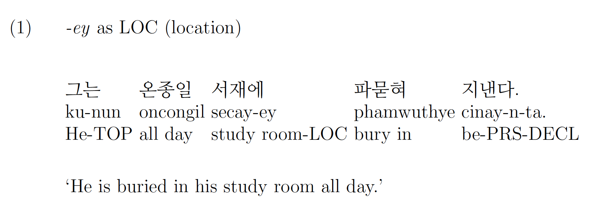

Goal (GOL) is a function that indicates the preceding word is where the object reaches. In the following sentence (i.e., this sentence is extracted from the file <i>V-naylyekkochita</i> in the Sejong Electronic Dictionary), <i>-ey</i> is playing the same role as <i>to</i> in English.

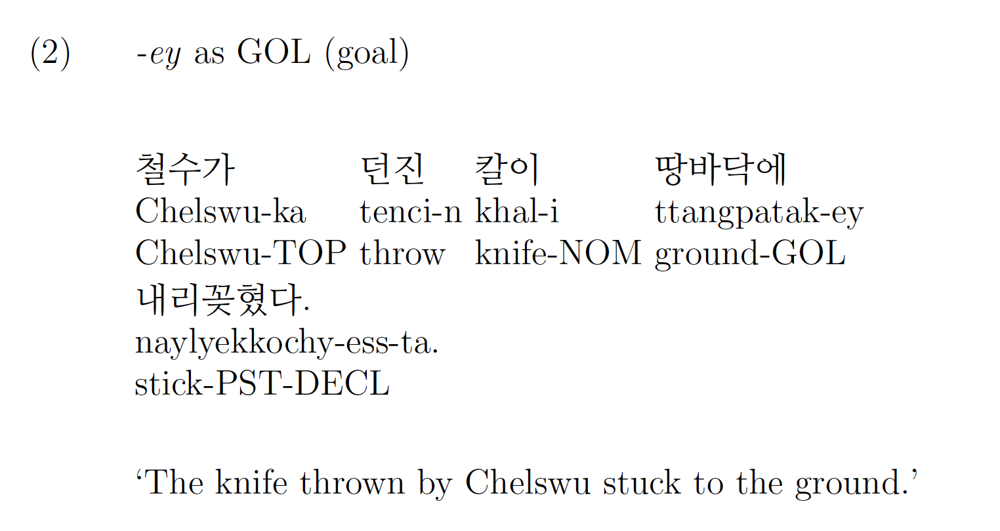

Effector (EFF) is a function that indicates that the preceding word influences the theme to act or change when an event occurs. In the following sentence (i.e., this sentence is extracted from the file <i>V-kentultayta</i> in the Sejong Electronic Dictionary), <i>-ey</i> is playing the same role as <i>by</i> in English.

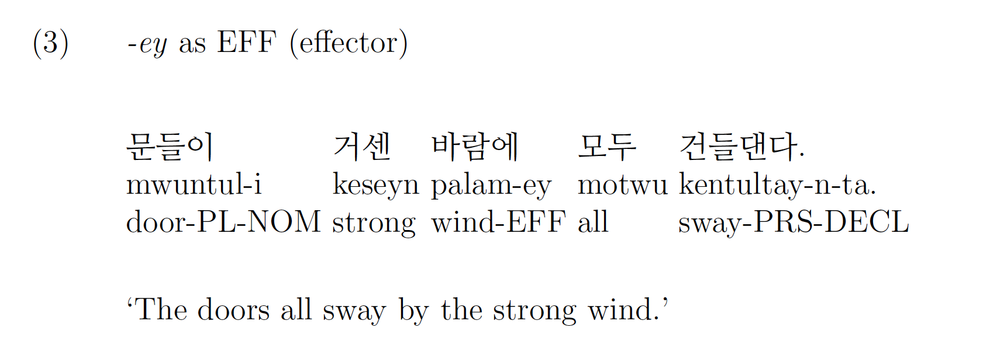

Criterion (CRT) is a function that indicates that the preceding word is the standard for quantitative classification of the specific property of the theme. In the following sentence (i.e., this sentence is extracted from the file <i>V-nakchalhata</i> in the Sejong Electronic Dictionary), <i>-ey</i> is playing the same role as <i>for</i> in English.

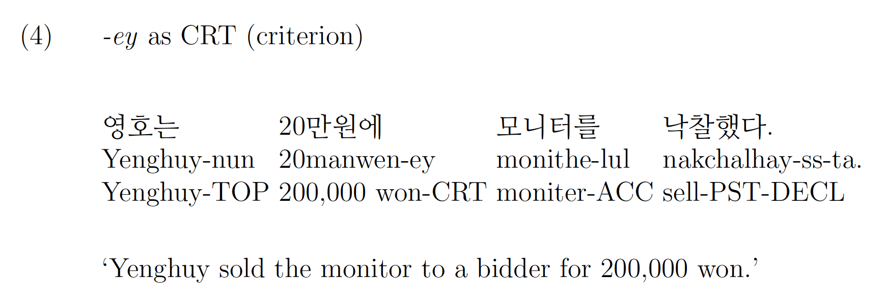

Theme (THM) is a function that makes the preceding word as an entity that directly receives the action of the verb. In the following sentence (i.e., this sentence is extracted from the file <i>V-hekicita</i> in the Sejong Electronic Dictionary), <i>-ey</i> is playing the same role as <i>for</i> in English.

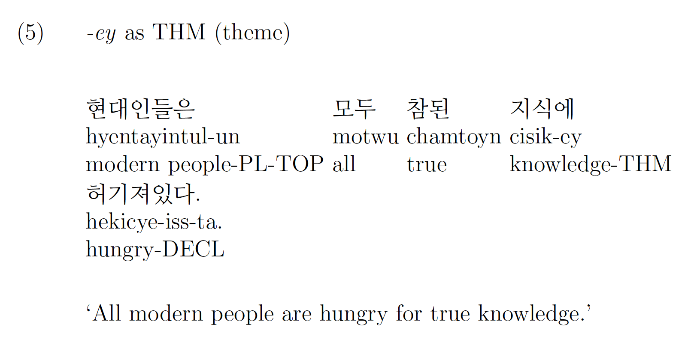

Instrument (INS) is a function that indicates the preceding word engages in an action or a process as a tool. In the following sentence (i.e., this sentence is extracted from the file <i>V-nokita</i> in the Sejong Electronic Dictionary), <i>-ey</i> is playing the same role as <i>in</i> in English.

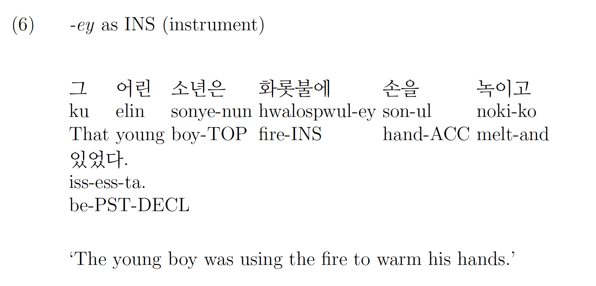

Agent (AGT) a function that makes the preceding word as an entity that intentionally carries out the action of the verb. In the following sentence (i.e., this sentence is extracted from the file <i>V-cecitoyta</i> in the Sejong Electronic Dictionary), <i>-ey</i> is playing the same role as <i>by</i> in English.

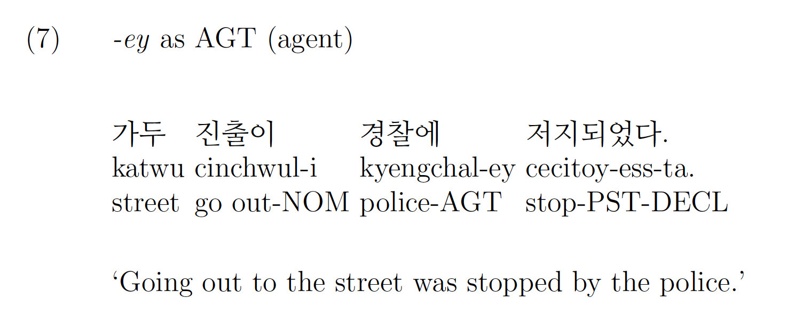

Final state (FNS) is a function that allows the preceding word to present the current state. In the following sentence (i.e., this sentence is extracted from the file <i>V-chwuchenhata</i> in the Sejong Electronic Dictionary), <i>-ey</i> is playing the same role as <i>as</i> in English.

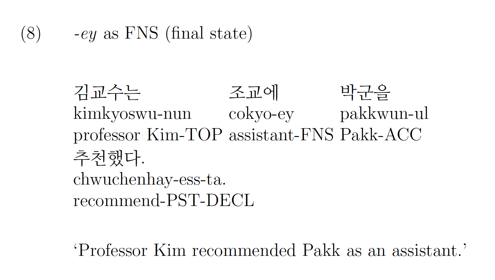

## <i>-eyse</i>

Source (SRC) is a function that indicates the origin of an action, the point at which the action is initiated. In the following sentence (i.e., this sentence is extracted from the file <i>V-ppopaollita</i> in the Sejong Electronic Dictionary), <i>-eyse</i> is playing the same role as <i>from</i> in English.

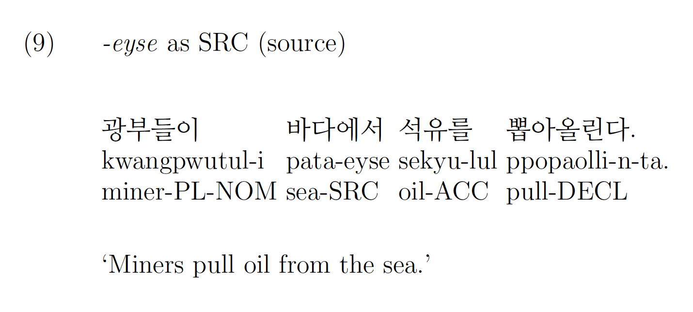

The definition of the location (LOC) is the same as described for <i>-ey</i> (location). In the following sentence (i.e., this sentence is extracted from the file <i>V-thayenata</i> in the Sejong Electronic Dictionary), <i>-eyse</i> is playing the same role as <i>in</i> in English.

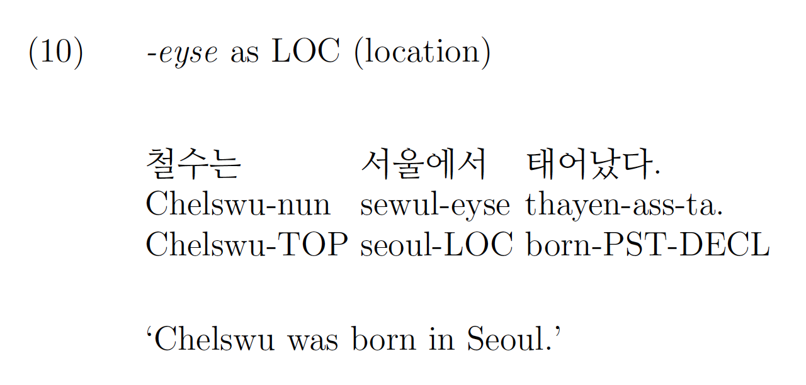

## <i>-(u)lo</i>

The definition of the final state (FNS) is the same as described above (see (8)). In the following sentence (i.e., this sentence is extracted from the file <i>V-chopingtoyta</i> in the Sejong Electronic Dictionary), <i>-(u)lo</i> is playing the same role as <i>as</i> in English.

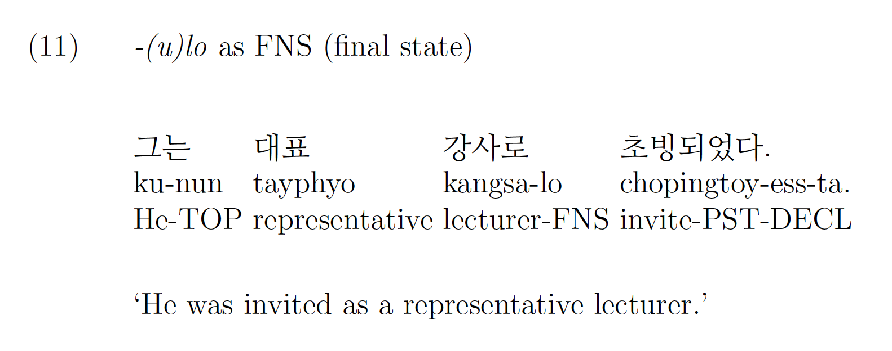

The definition of instrument (INS) is the same as described above (see (6)). In the following sentence (i.e., this sentence is extracted from the file <i>V-kamkita</i> in the Sejong Electronic Dictionary), <i>-(u)lo</i> is playing the same role as <i>with</i> in English.

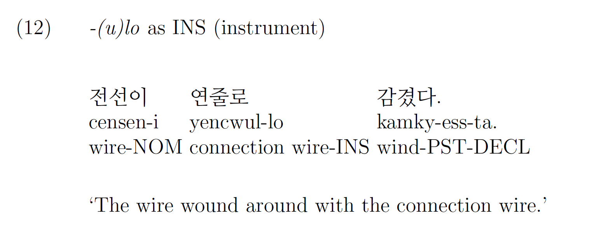

Direction (DIR) is a function to indicate the direction of the point at which the preceding word is directed. In the following sentence (i.e., this sentence is extracted from the file <i>V-talanata</i> in the Sejong Electronic Dictionary), <i>-(u)lo</i> is playing the same role as <i>into</i> in English.

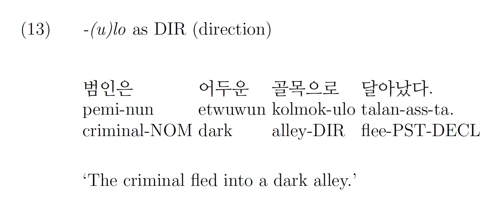

The definition of effector (EFF) is the same as described above (3). In the following sentence (i.e., this sentence is extracted from the file <i>V-koylowehata</i> in the Sejong Electronic Dictionary), <i>-(u)lo</i> is playing the same role as <i>due to</i> in English.

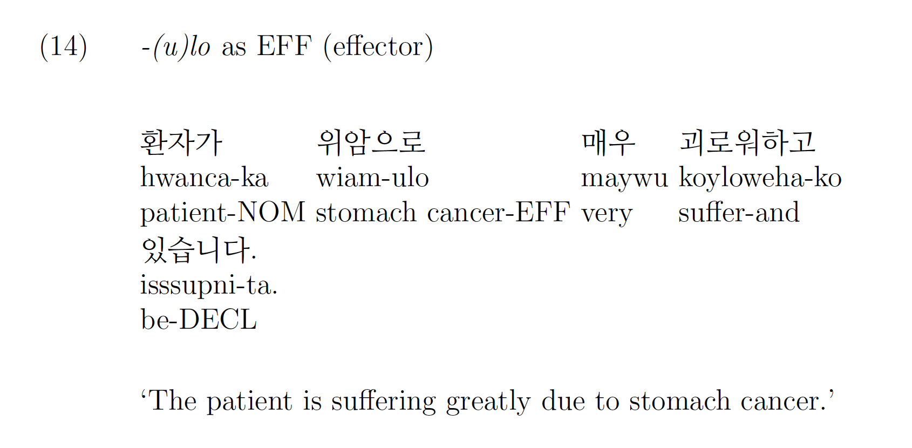

The definition of criterion (CRT) is the same as described above (see (4)). In the following sentence (i.e., this sentence is extracted from the file <i>V-paychatoyta</i> in the Sejong Electronic Dictionary), <i>-(u)lo</i> is playing the same role as <i>at</i> in English.

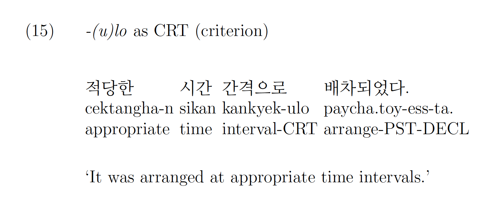

The definition of LOC is the same as described above (see (1)). In the following sentence (i.e., this sentence is extracted from the file  <i>V-apsonghata</i> in the Sejong Electronic Dictionary),  <i>-(u)lo</i> is playing the same role as  <i>to</i> in English.

